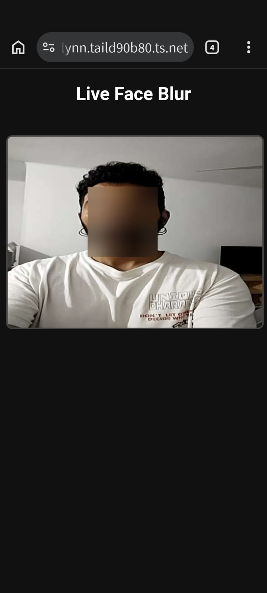

# PracticeBlur: Streaming de Desenfoque Facial en Tiempo Real

Este repositorio es un entorno de práctica aislado desarrollado como prueba de concepto para ser integrado a futuro en **SenseAI** (asistente de orientación por voz local). El objetivo de este módulo es garantizar la privacidad de terceros mediante la anonimización (blur/desenfoque) de rostros en tiempo real antes de que los frames pasen a los modelos de visión.

## 📸 Demostración



## ⚙️ Arquitectura y Stack Tecnológico

El sistema utiliza una arquitectura cliente-servidor orientada al streaming de baja latencia en redes locales o túneles VPN:

*   **Frontend:** HTML5 y Vanilla JavaScript. Captura la cámara del dispositivo mediante `getUserMedia` y extrae frames en base64 usando un `<canvas>` oculto (a 10 FPS por defecto).
*   **Comunicación:** WebSockets (bidireccional) para mantener un flujo continuo de frames sin el *overhead* de peticiones HTTP tradicionales.
*   **Backend:** Python con **FastAPI** (enrutamiento) y **Uvicorn** (servidor ASGI).
*   **Procesamiento (Computer Vision):** 
    *   **MediaPipe Tasks API (Vision):** Detección de rostros ultrarrápida optimizada para correr exclusivamente en CPU mediante el modelo BlazeFace.
    *   **OpenCV (`cv2`):** Decodificación de imagen, recorte (bounding box) y aplicación del filtro espacial (Gaussian Blur) sobre los rostros detectados.

## 🚀 Instalación y Despliegue Local

### 1. Clonar el repositorio y preparar el entorno
```bash
git clone https://github.com/tu-usuario/practiceBlur.git
cd practiceBlur
python3 -m venv .venv
source .venv/bin/activate
pip install -r requirements.txt
```

### 2. Descargar el modelo de MediaPipe
El backend utiliza la API moderna de MediaPipe Tasks, por lo que requiere tener el archivo binario del modelo explícitamente en la raíz del proyecto. Descargalo con:
```bash
wget -O detector.tflite https://storage.googleapis.com/mediapipe-models/face_detector/blaze_face_short_range/float16/1/blaze_face_short_range.tflite
```

### 3. Ejecutar el servidor
```bash
uvicorn main:app --host 0.0.0.0 --port 8000
```

## 🌐 Acceso y Pruebas con HTTPS
Para que los navegadores (especialmente en dispositivos móviles) permitan el acceso a la cámara vía WebRTC/MediaDevices, la conexión debe ser en un contexto seguro (`https://` o `localhost`). 

Para pruebas desde otros dispositivos, se recomienda utilizar **Tailscale Funnel** para exponer el puerto local mediante un túnel con certificado SSL válido:

```bash
# Ejecutar en otra terminal del servidor:
tailscale funnel 8000
```
Luego, ingresar desde el dispositivo móvil a la URL `.ts.net` generada.

---
*Módulo experimental en desarrollo.*