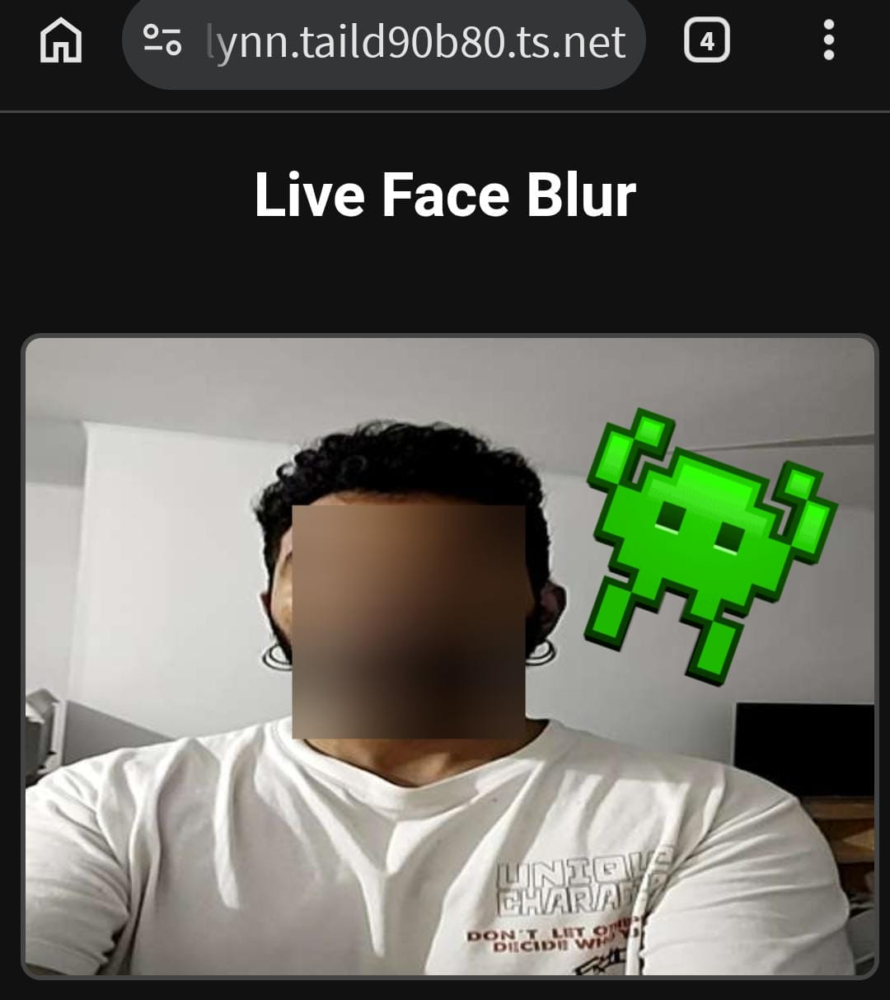

# PracticeBlur: Streaming de Desenfoque Facial en Tiempo Real

Este repositorio es un entorno de práctica aislado desarrollado como prueba de concepto para ser integrado a futuro en **SenseAI** (asistente de orientación por voz local). El objetivo de este módulo es garantizar la privacidad de terceros mediante la anonimización (blur/desenfoque) de rostros en tiempo real antes de que los frames pasen a los modelos de visión.

## 📸 Demostración



## ⚙️ Arquitectura y Flujo de Datos (Pipeline)

El sistema utiliza una arquitectura cliente-servidor orientada al streaming de baja latencia en redes locales o túneles VPN, evitando el *overhead* de peticiones HTTP tradicionales.

```text
📱 Cliente (Navegador Móvil)                  🖥️ Servidor (Backend Python)
┌─────────────────────────┐                   ┌─────────────────────────────────┐
│ 📷 getUserMedia (Cámara)│                   │ ⚡ FastAPI: WebSocket Endpoint   │
│           │             │    Frame Base64   │           │                     │
│           ▼             │ ────────────────► │           ▼                     │
│ 🖼️ Canvas (Extracción)  │      (10 FPS)     │ 🧠 OpenCV: Decodifica           │
│           ▲             │                   │ 🤖 MediaPipe: Detecta Rostro    │
│           │             │    Frame Base64   │ 🌫️ OpenCV: Bounding Box + Blur  │
│ 📺  (Renderizado)  │ ◄──────────────── │ 📦 OpenCV: Recodifica a JPEG    │
└─────────────────────────┘                   └─────────────────────────────────┘
```

### Stack Tecnológico
*   **Frontend:** HTML5 y Vanilla JavaScript.
*   **Comunicación:** WebSockets (bidireccional).
*   **Backend:** Python con **FastAPI** y **Uvicorn**.
*   **Computer Vision:** 
    *   **MediaPipe Tasks API:** Detección de rostros ultrarrápida (BlazeFace) en CPU.
    *   **OpenCV (`cv2`):** Manipulación matricial y filtro espacial (Gaussian Blur).

## 🚀 Instalación y Despliegue Local

### 1. Clonar el repositorio y preparar el entorno
```bash
git clone https://github.com/tu-usuario/practiceBlur.git
cd practiceBlur
python3 -m venv .venv
source .venv/bin/activate
pip install -r requirements.txt
```

### 2. Descargar el modelo de MediaPipe
El backend utiliza la API moderna de MediaPipe Tasks, requiriendo el archivo binario del modelo en la raíz del proyecto:
```bash
wget -O detector.tflite https://storage.googleapis.com/mediapipe-models/face_detector/blaze_face_short_range/float16/1/blaze_face_short_range.tflite
```

### 3. Ejecutar el servidor
```bash
uvicorn main:app --host 0.0.0.0 --port 8000
```

## 🌐 Acceso y Pruebas con HTTPS (Tailscale)

Las APIs del navegador para acceder a la cámara exigen un contexto seguro (`https://`). Para pruebas remotas sin configurar certificados SSL manuales, utilizamos **Tailscale Funnel**:

```bash
# Ejecutar en otra terminal del servidor:
tailscale funnel 8000
```
Luego, ingresar desde el dispositivo móvil a la URL `.ts.net` generada por el túnel.

## 🗺️ Roadmap y Estado del Proyecto

- [x] Setup inicial de arquitectura cliente-servidor con WebSockets.
- [x] Captura de video en frontend (Vanilla JS) y envío de frames en Base64.
- [x] Integración de MediaPipe Tasks API para detección de rostros optimizada en CPU.
- [x] Aplicación de desenfoque (Gaussian Blur) básico sobre el bounding box usando OpenCV.
- [x] Exposición segura a través de internet usando Tailscale Funnel.
- [ ] **Implementar padding dinámico en el bounding box para cubrir áreas periféricas (cabello, orejas, mandíbula) y mejorar la anonimización real.**
- [ ] Ajustar el nivel de desenfoque y compresión JPEG para optimizar latencia.
- [ ] Preparar el código como módulo/middleware para su integración final en SenseAI.